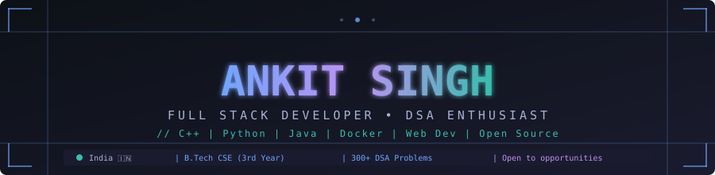

<div align="center">



<br/>



</div>

<br/>

<div align="center">

[](https://github.com/Ankit863326)&nbsp;
[](https://linkedin.com/in/ankit-singh-048aa02bb)&nbsp;
[](mailto:rishisinghri226@gmail.com)

</div>

---


## 🧑‍💻 About Me

```typescript
const ankit: Developer = {
  name      : "Ankit Singh",
  role      : "Full Stack Developer & DSA Enthusiast",
  education : "B.Tech CSE (3rd Year)",
  location  : "India 🇮🇳",

  expertise : [
    "Data Structures & Algorithms",
    "Full-Stack Web Development",
    "Systems Programming (C/C++)",
    "Containerization with Docker",
  ],

  currentlyLearning : ["Full-Stack Web Programming", "Open Source", "System Design"],
  cp                : "300+ DSA problems solved",
  openTo            : "Internships | Collabs | Open Source",
  contact           : "rishisinghri226@gmail.com",
};
` ` `

<br clear="right"/>

---

## 🛠️ Tech Arsenal

<div align="center">

### 💻 Languages


### ⚙️ Tools & DevOps


</div>

---

## 🌱 Currently Working On

- 🤝 Actively contributing to [Codelyzer-Bot/Job](https://github.com/Codelyzer-Bot/Job)
- 🌐 Building new projects for my Web Development portfolio
- 🧠 Sharpening DSA problem-solving skills daily

---

## 🏅 Competitive Programming

<div align="center">

| Platform | Status | Focus |
|---|---|---|
| 🔵 LeetCode | Active | **300+ problems solved** — favourite subject! |
| 🟢 GeeksForGeeks | Active | Regular problem solver |

</div>

---

## 🏆 GitHub Trophies

<div align="center">


</div>

---

## 📊 GitHub Analytics

<div align="center">


&nbsp;


</div>

<div align="center">


</div>

<div align="center">


</div>

---

## 💬 Favourite Quote

<div align="center">

<br>

> *"A man can be defeated but not destroyed."*
>
> — **Ernest Hemingway**

<br>

</div>

---

## 🌐 Let's Build Something Together

<div align="center">

[](https://linkedin.com/in/ankit-singh-048aa02bb)&nbsp;
[](mailto:rishisinghri226@gmail.com)&nbsp;
[](https://github.com/Ankit863326)

</div>

---

<div align="center">

**`Code with intent. Build with purpose. Ship with pride.`**

*Made with 🧠 + ☕ + 🎧 by Ankit Singh*

</div>
```

**Two things to note:**

1. The triple backtick closing the `typescript` code block — in the actual file, replace `` ` ` ` `` (with spaces) with ` ``` ` (no spaces). I had to add spaces here so it doesn't break the display.

2. The `./assets/` SVG lines at the top — remove those two `` lines if you don't have custom SVG assets in your repo, otherwise GitHub will show broken images.
